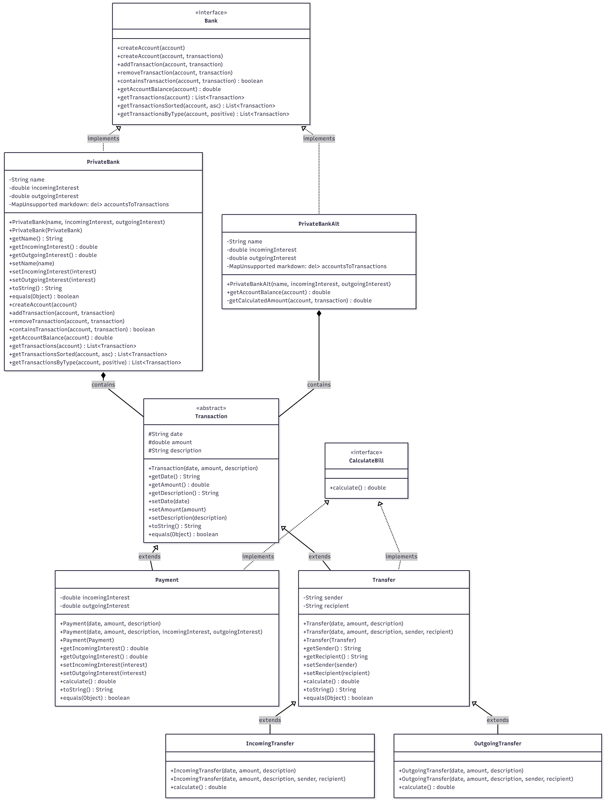

<div align="center">

  <h1>🏦 Java Banking System with Persistence</h1>
  
  <p>
    A robust, object-oriented banking simulation developed in Java.<br>
    Features <b>Data Persistence</b> (JSON), <b>Polymorphism</b>, and <b>Unit Testing</b>.
  </p>

  <!-- Badges -->
  <p>
    
    
    
    
  </p>

  <br />

  <!-- UML Diagram -->
  
  <br>
  <i>Figure 1: System Architecture & Class Hierarchy</i>

</div>

<br />

---

## 🚀 Key Features

### 💾 **Data Persistence (JSON)**
* **Custom Serialization:** Solved the challenge of saving polymorphic lists (`List<Transaction>`) by implementing a custom `TransactionSerializer`.
* **Metadata Tagging:** Automatically injects a `"CLASSNAME"` tag into JSON files to distinguish between `Payment` and `Transfer` objects upon reloading.
* **Auto-Sync:** Ensures real-time synchronization between Runtime Memory (RAM) and the File System.

### 🧬 **Object-Oriented Architecture**
* **Polymorphism:** Distinct calculation logic for `IncomingTransfer` (positive flow) vs. `OutgoingTransfer` (negative flow).
* **Encapsulation:** Critical file operations (`writeAccount`) are strictly `private` to protect data integrity from external interference.
* **Robust Interfaces:** Adheres to a strict `Bank` contract, updated to safely handle `IOExceptions`.

### 🛡️ **Comprehensive Testing (JUnit 5)**
* **Integration Tests:** Validates the full persistence lifecycle (Save → Restart App → Load Data).
* **Unit Tests:** Verifies interest calculation logic and exception handling.
* **Test Isolation:** Uses `@AfterEach` to auto-clean test data (`TestBankData`), preventing "zombie files" from breaking future tests.

---

## 📂 Project Structure

```text
src/
├── main/java/bank/
│   ├── Bank.java                 # Interface contract defining banking operations
│   ├── PrivateBank.java          # Core Engine (Handles File I/O & Logic)
│   ├── Transaction.java          # Abstract base class
│   ├── Payment.java              # Handles deposits/withdrawals with interest
│   ├── Transfer.java             # Handles money transfers between users
│   ├── TransactionSerializer.java # Custom Gson adapter (The "Translator")
│   └── Main.java                 # Application Entry Point
│
└── test/java/bank/
    ├── PaymentTest.java          # Math & Logic verification
    ├── TransferTest.java         # Polymorphism verification
    └── PrivateBankTest.java      # System & Persistence verification

